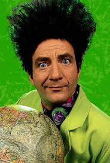

# Mi mundo de Beakman (HISTORIA)

<p align="center">
  
</p>

<p align="center">
  <em>GPT personalizado para ensenar Historia de 1º de la ESO</em><br>
  <em>Inspirado en el estilo de Beakman: curioso, divertido y reflexivo</em>
</p>

---

## Que es este proyecto

Un tutor de historia basado en ChatGPT disenado para estudiantes de 12 anos (1º de la ESO en Espana). El GPT adopta la personalidad de Beakman, el famoso cientifico televisivo, y prioriza que el alumno **entienda** la historia, no solo que memorice fechas.

**Publico objetivo:** Profesores, familias y uso educativo supervisado.

---

## Como crear tu propio GPT

Sigue estos pasos para crear tu propia copia de este GPT. No necesitas conocimientos tecnicos, solo una cuenta de ChatGPT Plus.

> **Referencia rapida:** El archivo `gpt/configuracion.txt` contiene todos los textos listos para copiar y pegar en el editor de GPTs.

### Requisitos previos

- **Cuenta de ChatGPT Plus** ($20/mes) - Los GPTs personalizados solo estan disponibles para usuarios de pago
- **Navegador web** - Chrome, Firefox, Safari o Edge
- **Los archivos de este repositorio** - Descargalos o clona el repositorio

### Paso 1: Acceder al editor de GPTs

1. Abre tu navegador y ve a: **https://chat.openai.com**
2. Inicia sesion con tu cuenta de ChatGPT Plus
3. En el menu lateral izquierdo, haz clic en **"Explorar GPTs"**
4. En la esquina superior derecha, haz clic en **"Crear"**
5. Se abrira el editor de GPTs con dos pestanas: "Crear" y "Configurar"
6. Haz clic en la pestana **"Configurar"** (la usaremos para configurar todo manualmente)

### Paso 2: Informacion basica

En la pestana "Configurar", rellena los siguientes campos:

**Nombre:**
```
Mi mundo de Beakman (HISTORIA)
```

**Descripcion:**
```
Guia interactiva para ensenar y explorar Historia. Inspirado en el estilo de Beakman: curioso, divertido y reflexivo. Disenado para profesores, familias y uso educativo supervisado.
```

**Imagen de perfil:**
1. Haz clic en el icono de imagen
2. Selecciona "Subir una foto"
3. Busca y selecciona el archivo `gpt/logo.jpeg` de este repositorio

### Paso 3: Instrucciones (el cerebro del GPT)

El campo **Instrucciones** es donde defines como se comportara el GPT. Aqui es donde copiaras el prompt principal.

1. Abre el archivo `gpt/Curso_Historia_1ESO_Prompt.txt` con cualquier editor de texto (Bloc de notas, TextEdit, etc.)
2. Selecciona **todo el contenido** (Ctrl+A o Cmd+A)
3. Copialo (Ctrl+C o Cmd+C)
4. En el editor de GPTs, haz clic en el campo "Instrucciones"
5. Pega el contenido (Ctrl+V o Cmd+V)

**Por que es importante este archivo?**

El prompt de instrucciones define:
- La personalidad del GPT (paciente, cercano, nunca ridiculiza)
- El metodo de ensenanza (contexto primero, luego hechos, finalmente fechas)
- Como gestionar bloqueos del alumno
- Que comandos puede usar el estudiante

### Paso 4: Iniciadores de conversacion

Los "Iniciadores de conversacion" son botones que aparecen cuando el alumno abre el chat. Le ayudan a saber como empezar.

1. Busca la seccion "Iniciadores de conversacion"
2. Haz clic en "Anadir iniciador" y escribe:

```
¿Te has quedado en blanco o no sabes por donde empezar? Escribe Ayuda y te guio paso a paso.
```

> **Nota:** Opcionalmente puedes anadir mas iniciadores como "Quiero repasar un tema", "No entiendo este ejercicio" o "Dame un ejercicio para practicar".

### Paso 5: Conocimiento (Base de conocimiento)

La seccion **Conocimiento** permite subir archivos que el GPT usara como referencia. Esto es fundamental para que las respuestas sean precisas y coherentes con el temario.

1. Busca la seccion "Conocimiento"
2. Haz clic en "Subir archivos"
3. Navega a la carpeta `knowledge/` de este repositorio
4. Selecciona **todos** los archivos `.txt`
5. Haz clic en "Abrir"

**Por que subir estos archivos?**

Sin archivos de Conocimiento, el GPT improvisaria basandose en su conocimiento general, lo cual puede generar:
- Contenido no adaptado al nivel de 1º ESO
- Explicaciones inconsistentes entre sesiones
- Mayor riesgo de "alucinaciones" (inventar informacion)

Con archivos de Conocimiento, el GPT consulta primero estos archivos y da respuestas coherentes con el temario definido.

### Paso 6: Capacidades

Esta seccion define que herramientas adicionales puede usar el GPT.

Configuracion recomendada:

| Capacidad | Activar | Razon |
|-----------|---------|-------|
| **Navegacion web** | Si | Permite buscar informacion adicional en fuentes educativas cuando el Conocimiento no es suficiente |
| **Generacion de imagenes (DALL-E)** | Opcional | Puede generar ilustraciones historicas, pero no es esencial |
| **Interprete de codigo** | No | No es necesario para historia |

### Paso 7: Guardar el GPT

1. Revisa que todos los campos esten completos
2. En la esquina superior derecha, haz clic en **"Crear"** (o **"Actualizar"** si estas editando)
3. Elige la visibilidad:
   - **Solo yo**: Solo tu puedes usarlo
   - **Cualquiera con el enlace**: Cualquiera con el enlace puede usarlo
   - **Publico**: Aparece en la tienda de GPTs
4. Haz clic en "Guardar"

Listo! Tu GPT esta creado y puedes empezar a usarlo.

---

## Proteccion contra alucinaciones y desinformacion

Los modelos de lenguaje como GPT-4 pueden "alucinar", es decir, inventar informacion que parece correcta pero no lo es. En un contexto educativo, esto es especialmente peligroso.

Este GPT incluye varias capas de proteccion:

### 1. Conocimiento como fuente principal

El prompt indica explicitamente:
> "Usa siempre los archivos de Conocimiento como fuente principal."

Esto fuerza al GPT a consultar primero el contenido verificado antes de improvisar.

### 2. Autorizacion explicita para decir "no lo se"

El prompt incluye:
> "Si no estas seguro: dilo, pide aclaraciones, no inventes datos ni ejemplos."

Los modelos de lenguaje tienden a dar siempre una respuesta, aunque no la sepan. Esta instruccion les da "permiso" para admitir desconocimiento, reduciendo las alucinaciones.

### 3. Limitacion de fuentes externas

Cuando el GPT necesita buscar informacion adicional:
> "Usa solo fuentes educativas o institucionales fiables. Resume y adapta. Evita datos no contrastados."

Esto evita que el GPT cite fuentes dudosas o informacion no verificada.

### 4. Transparencia sobre limitaciones

El prompt indica:
> "Si falta contenido, indicalo y propone subir el archivo adecuado."

El GPT avisara cuando no tenga informacion suficiente en lugar de inventarla.

---

## Estructura del repositorio

```
/beakman_history
├── README.md                   # Este archivo (guia completa)
├── CLAUDE.md                   # Guia para asistentes de codigo
├── gpt/                        # Configuracion del GPT
│   ├── configuracion.txt       # Textos para copiar/pegar en el editor
│   ├── logo.jpeg               # Imagen de perfil del GPT
│   └── Curso_Historia_1ESO_Prompt.txt    # Instrucciones principales
├── knowledge/                  # Archivos de Conocimiento (subir al GPT)
│   ├── 00_Mapa_del_Curso_Historia.txt
│   └── ...
└── docs/                       # Documentacion tecnica
    └── Curso_Historia_1ESO_Prompt_Comentado.txt
```

---

## Curriculo incluido

El GPT cubre el temario de Historia de 1º de la ESO:

(Por definir segun el curriculo oficial)

El orden es progresivo: cada tema se apoya en los anteriores.

---

## Comandos disponibles para el alumno

El estudiante puede escribir estos comandos en lenguaje natural (no hace falta escribirlos exactamente asi):

| Comando | Que hace |
|---------|----------|
| **Ayuda** | Guia paso a paso para empezar |
| **Mapa del curso** | Muestra todos los temas disponibles |
| **Siguiente tema** | Avanza al tema siguiente |
| **Tema anterior** | Vuelve al tema anterior |
| **Repaso rapido** | Resumen del tema actual |
| **Ejercicios guiados** | Practica con ayuda del GPT |
| **Pensar sin memorizar** | Ejercicios de razonamiento sin recordar fechas |
| **Errores tipicos** | Muestra los fallos mas comunes |
| **Explica con ejemplo** | Pide un ejemplo practico o anecdota |
| **Explicamelo con un dibujo** | Pide una explicacion visual |
| **Explicamelo como un esquema** | Pide un diagrama conceptual o linea del tiempo |
| **Consejo de estudio** | Tips para estudiar mejor |

---

## Filosofia pedagogica

El GPT sigue principios pedagogicos especificos. Cada uno tiene una razon tecnica:

### 1. Comprension antes que memorizacion

> "Prioriza siempre comprension, razonamiento, conexion con el mundo actual. Antes que memorizar fechas o nombres sin contexto."

**Por que:** Los modelos de lenguaje son buenos generando listas de datos, pero pueden hacerlo sin sentido. Esta instruccion fuerza explicaciones con significado.

### 2. Contexto → Hechos → Fechas

> "Explica siempre primero el contexto y por que importa. Despues los hechos principales. Finalmente las fechas y datos concretos."

**Por que:** Evita la memorizacion sin comprension. Los alumnos que ven fechas antes de entender el contexto memorizan sin comprender.

### 3. El error es parte del aprendizaje

> "Nunca ridiculizas errores ni minimizas dificultades. Nunca digas que algo es facil o evidente."

**Por que:** Frases como "es facil" generan ansiedad en alumnos que no lo entienden. Normalizar el error reduce bloqueos.

### 4. Estructura repetible

Cada explicacion sigue el mismo patron:
1. Contexto visual/situacional
2. Idea historica central
3. Ejemplo o anecdota
4. Preguntas para pensar
5. Mini comprobacion
6. Opciones para continuar

**Por que:** La predictibilidad reduce la carga cognitiva. El alumno sabe que esperar.

---

## Personalizacion

### Anadir mas temas

1. Crea un nuevo archivo en `knowledge/` con el formato:

```
TEMA X – NOMBRE DEL TEMA

Descripcion breve del tema.

Ideas clave:
- Punto 1
- Punto 2

Errores tipicos:
- Error comun 1

Relacion con otros temas:
Conexion con temas anteriores/posteriores.
```

2. Sube el nuevo archivo a la seccion Conocimiento del GPT en el editor de GPTs

### Modificar el comportamiento

1. Edita `gpt/Curso_Historia_1ESO_Prompt.txt`
2. Consulta `docs/Curso_Historia_1ESO_Prompt_Comentado.txt` para entender el proposito de cada seccion antes de modificar
3. Copia el nuevo contenido en el campo Instrucciones del editor de GPTs

---

## Limitaciones conocidas

| Limitacion | Descripcion |
|------------|-------------|
| **Actualizacion manual** | Los cambios en este repositorio no se sincronizan automaticamente con el GPT. Debes actualizar manualmente en el editor de GPTs. |
| **Tamano de Conocimiento** | OpenAI limita el tamano de los archivos de Conocimiento. Si anades mucho contenido, puede que necesites dividirlo. |
| **Sin historial entre sesiones** | El GPT no recuerda conversaciones anteriores. Cada chat empieza de cero. |
| **Dependencia de ChatGPT Plus** | Requiere suscripcion de pago ($20/mes). |

---

## Descargo de responsabilidad

> **IMPORTANTE: Lee esto antes de usar el proyecto**
>
> Este proyecto se proporciona **"tal cual"**, sin garantias de ningun tipo.
>
> - Este GPT es una **herramienta de apoyo educativo**, no un sustituto de profesores, tutores o profesionales de la educacion.
> - Las respuestas generadas por el GPT pueden contener **errores o imprecisiones**. A pesar de las medidas de proteccion implementadas, los modelos de lenguaje pueden "alucinar" (inventar informacion).
> - **Se recomienda supervision adulta** durante el uso por parte de menores.
> - El autor **no se hace responsable** de:
>   - Errores en el contenido generado por el GPT
>   - Decisiones academicas tomadas basandose en las respuestas del GPT
>   - Cualquier perjuicio derivado del uso de este proyecto
> - La imagen utilizada (Beakman) es propiedad de sus respectivos titulares y se usa aqui con fines educativos y sin animo de lucro.
> - Este proyecto **no esta afiliado** con OpenAI, ChatGPT, ni con los creadores originales del programa "El mundo de Beakman".
>
> **Usalo como complemento, nunca como unica fuente de aprendizaje.**

---

## Licencia

Este proyecto esta licenciado bajo **Creative Commons Attribution-ShareAlike 4.0 International (CC BY-SA 4.0)**.

[](https://creativecommons.org/licenses/by-sa/4.0/)

Esto significa que puedes:
- **Compartir** — copiar y redistribuir el material en cualquier medio o formato
- **Adaptar** — remezclar, transformar y construir sobre el material para cualquier proposito, incluso comercial

Con las siguientes condiciones:
- **Atribucion** — Debes dar credito apropiado, proporcionar un enlace a la licencia e indicar si se realizaron cambios
- **CompartirIgual** — Si remezclas, transformas o creas a partir del material, debes distribuir tu contribucion bajo la misma licencia que el original

Ver el archivo [LICENSE](LICENSE) para mas detalles.

---

## Homenaje a "El mundo de Beakman"

<p align="center">
  <a href="https://www.youtube.com/@ElMundodeBeakman-j2m/featured">
    
  </a>
</p>

Este proyecto es un humilde homenaje a **"El mundo de Beakman"** (*Beakman's World*), la serie de television educativa que entre 1992 y 1998 demostro que la ciencia podia ser divertida, accesible y emocionante.

Gracias a:

- **Paul Zaloom**, el actor que dio vida a Beakman con su energia inagotable, su pelo imposible y su capacidad unica para hacer que lo complejo pareciera sencillo.
- **Josie**, **Liza** y **Phoebe**, las asistentes que acompanaron a Beakman y demostraron que la curiosidad no tiene genero.
- **Lester**, la rata sarcastica que nos recordaba que hasta las preguntas mas "tontas" merecen una respuesta.
- **Jok Church**, creador del comic original "You Can with Beakman and Jax" que inspiro la serie.
- Todo el equipo de produccion que hizo posible que millones de ninos en todo el mundo descubrieran el placer de preguntar "¿por que?".

En una epoca sin internet ni YouTube, Beakman fue para muchos de nosotros la puerta de entrada al pensamiento cientifico. Su legado sigue vivo en cada profesor que explica con pasion, en cada padre que responde con paciencia, y en cada nino que no deja de preguntar.

> *"La ciencia no es dificil. Solo hay que explicarla bien."*

Este proyecto intenta mantener vivo ese espiritu: **aprender debe ser una aventura, no una obligacion**.

---

<p align="center">
  <em>"Entender es mas importante que memorizar"</em>
</p>
